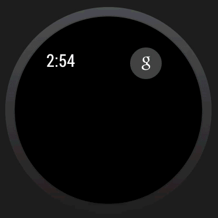

Pocket Prototype SDK for Android Wearables
==========================

A simple project to add an "Add to Pocket" action to your Android Wear notifications, with just one line of code.

```java
PocketWearableNotificationUtil.addPocketAction(wearableBuilder, notifyId, url, null, context);
```




Prototype
-----

Android's Wear APIs are in a Developer Preview and may change at any time. This Pocket SDK should also be considered a work in progress. Also, we strongly encourage you to follow the [Wear Design Guidelines](http://developer.android.com/wear/design/index.html) and only push content to a user's wearable if they have asked to receive such notifications.

Use Cases
-----
[Please see our blog post.](http://getpocket.com/blog/2014/03/android-wear-prototype-quick-sharing-to-pocket)


Setup
-----

1. Add the project contained in "library" as an Android Library Project. (Here's how to from  [Eclipse](http://developer.android.com/tools/projects/projects-eclipse.html#ReferencingLibraryProject) and from the [Command Line](http://developer.android.com/tools/projects/projects-cmdline.html#ReferencingLibraryProject))

2. Add the Android Wear SDK jar to the build path of the Library Project. *In order to get this jar you [must sign up for the Developer Preview](http://developer.android.com/wear/preview/start.html).*

3. Add the latest version of the Android Support Library to the Library Project. [How to install](http://developer.android.com/tools/support-library/setup.html).

4. Add a reference to <code>PocketIntentReceiver</code> in your <code>AndroidManifest.xml</code> file within <code>application</code>.

```xml
<receiver android:name="com.pocket.util.PocketIntentReceiver" android:exported="false">
	<intent-filter>
    	<action android:name="com.pocket.wear.ACTION_ADD_TO_POCKET" />
	</intent-filter>
</receiver>
```

Usage
-----

First create your [<code>WearableNotifications.Builder</code>](http://developer.android.com/wear/notifications/creating.html#NewFeatures) like you normally would. For example:

```java
String url = "http://bicepkeck.org/";
int notifyId = 5;

NotificationCompat.Builder builder = new NotificationCompat.Builder(this)
	.setContentTitle("Sigma 5.9!")
	.setContentText("BICEP2 announces breakthrough")
	.setSmallIcon(R.drawable.ic_notification_icon);
	    
WearableNotifications.Builder wearableBuilder = new WearableNotifications.Builder(builder);
```

Then, to add the Pocket action, all you need to do is:

```java
PocketWearableNotificationUtil.addPocketAction(wearableBuilder, notifyId, url, null, context);
```

If Pocket is installed on the user's device, it will add the action. If not, nothing will be added to the builder.

The <code>url</code> is whatever link that should be saved to Pocket if the uses taps the action. The <code>notifyId</code> should be the id you later use to show the notification. For example:

```java
NotificationManagerCompat.from(context).notify(notifyId, wearableBuilder.build());
```


